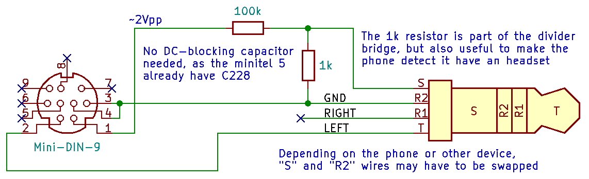

# Minitel 5

The Minitel was a french videotext terminal with an embedded modem which had its Golden Age before the rise of Internet. Typically cubic, with an included CRT screen and, more importantly, you could have one at home for cheap (the model 1 was "lent" for free), so, it was a huge success and a lot of people (including me) had their first experience "being online" playing with that thing. The Minitel 5 was a version really more rare to encounter. Flat, with an LCD screen and contained a rechargeable battery, this "laptop-style" terminal could be used in phone booths and cars.

I've got one, but [it is very strangely crashing at the second key press](https://www.youtube.com/watch?v=lb3u2duY9KQ). As there seems to be no documentation yet available for it, I made this git repository.

Later, `MN4` was found faulty. Not _just_ a battery-powered backup SRAM are you, heh?

## EPROM Dumps

There are two 27C256 EPROM on the Minitel 5 board.

* The `MN8` EPROM (directly soldered), is connected to the character generation IC and contains solely the bitmap font. 485 '16-bytes' zones from 0x6000 to 0x7E5F, with only the first 10 bytes used in each block (the 6 extra are always 0x00), one byte for each line of each character, where each bit is a pixel. Everything before address 0x6000 and from 0x7E50 to the end is filled with 0xFF.

[Link to the character generator EPROM dump file](dumps/minitel5_character_generator_eprom.bin)

* The other one is the main EPROM, in socket `MN3`, containing all the firmware as the 80C32 microcontroller is ROMless. Among with the firmware version (HX0141AA1/P07), we could find the date 1990-04-23 in it. As my minitel 5 is crashing at keystrokes, I originally had doubts about it, but we could test my EPROM working once inserted in the Alexxr6's minitel 5 in place of his own `MN3` EPROM.

[Link to the HX0141AA1/P07 firmware EPROM dump file](dumps/1990-04-23_HX0141AA1_P07.bin)
[(disassembly)](dumps/1990-04-23_HX0141AA1_P07.dis)

* This is the dump of Alexxr6's minitel `MN3` EPROM. We could also find a date (1990-04-13) and the version number (HX0141BA1/P05).

[Link to the HX0141BA1/P05 firmware EPROM dump file](dumps/1990-04-13_HX0141BA1_P05.bin)
[(disassembly)](dumps/1990-04-13_HX0141BA1_P05.dis)

* And this is the `MN3` for another Minitel 5 from Alexxr6, which was received in a very bad condition due to water damage. This one had it's VIDEOPLAT and DECOPLAT removed (more about these ICs further down). However, the date found in the dump is 1990-07-11, version number HX0141BA2.

[Link to the HX0141BA2 firmware EPROM dump file](dumps/1990-07-11_HX0141BA2.bin)
[(disassembly)](dumps/1990-07-11_HX0141BA2.dis)

## How to disassemble EPROM dumps?

	sudo apt-get install dis51 srecord
	srec_cat input_file.bin -binary -o - -intel | dis51 -l 0 > output_file.dis

[8051 Instruction Set](https://www.win.tue.nl/~aeb/comp/8051/set8051.html)

## Integrated circuits list

* `MN1` MHS 80C32 (MCU)
* `MN2` MHS MBSR-2000F11-5 DECOPLAT-1
* `MN3` NEC D27C256AD-15 (main EPROM)
* `MN4` Sharp LH5164-10 (backup RAM)
* `MN5` ROM/RAM "dual-dual row" (empty socket)
* `MN6` OKI M6255 (dot matrix lcd controller)
* `MN7` MHS MBSM-2000F05-5 VIDEOPLAT-1)
* `MN8` NEC D27C256AD-15 (bitmap font EPROM)
* `MN9` Philips FCB61C65LL-70T (SRAM)
* `MN10` Philips FCB61C65LL-70T (SRAM)
* `MN11` Motorola HC245A (3–state octal latch)
* `MN12` Motorola HC245A (3–state octal latch)
* `MN13` Motorola HC00A (quad 2-input NAND gate)
* `MN14` Harris HC04 (hex inverter)
* `MN15` Motorola HC245A (3–state octal latch)
* `MN16` Motorola HC245A (3–state octal latch)
* `MN18` Motorola HC4075 (triple 3-input OR gate)
* `MN19` RCA(?) HC273 (octal D latch w/common clock and reset)
* `MN201` ST TSB7513CP (single chip asynchronous FSK modem)
* `MN202` Philips PC74HC4053T (triple 2-channel analog multiplexer/demultiplexer)
* `MN203` TI(?) 27M4C (quad low power CMOS op-amp)
* `MN204` ST EFG71891PD (DTMF generator w/serial input)
* `MN205` Harris HC4052 (dual 4-channel analog multiplexer/demultiplexer)
* `MA101` Motorola MC78M08CT (8V positive linear regulator)
* `MA102` TL431 (precision programmable reference)
* `MA103` National LM3578N (DIP-8 switching regulator)
* `MA104` National ADC0831CCN (single differential input 8-bit ADC w/serial I/O)
* `MA105` National LM385M (1.2V micropower voltage reference)
* `MA201`, `MA202`, `MA203` Harris H11AG2 (phototransistor optocouplers)

## PCB Reverse Engineering

This was the crazy part of this project. It took months for redoing the schematics from the board.
Also, this board is a AY4 version from Matra, with some factory mods (cut traces, manually added wires, also not mounted components).

[Link to the large GIMP file (> 100MB)](pcb/minitel5-ay4-pcb.xcf)

## Reversed schematics

Pfiuh. This was hard work for sure!

[Link to the Kicad files directory](kicad/)

[Link to the schemarics PDF export file](kicad/output/minitel5.pdf)

* MCU, reset circuitry, main EPROM, serial communications, EPROM, modem, extension cartridges (ROM or RAM), radiocom 2000 connector, sound output, keyboard pins header

* Video generation circuits, outputs to the LCD panel

* Power supplies, main and backup batteries, trickle and fast charger, ADC (for checking battery level)

* Phone line interface

## J202 connector (for connecting radio-phone "Radiocom 2000" or acoustic coupler)

I did play a little bit with that connector, a scope, and a low frequency generator.

| Pin | Direction | Signal |
| --- | --------- | ------ |
| 1 | Output | Modem audio signal output. Measured at 2Vpp/733mVrms (emitting the 390Hz carrier) - or 1.3Vpp/460mVrms (1300Hz carrier, modem reversed)
| 2 | Input	| Modem audio signal input. 0.5Vpp seems fine?
| 3 | Ground
| 4 | Input	| Connected to ground as long as the phone line is open: needed to use Conn/Fin key. Can also enable the radiocom mode. Wake the minitel from deep sleep. Beware, 8V may be present from a 22k resistor on this pin.
| 5 | Input	| Connect to ground to activate the "radiocom mode". Disable dialling DTMF from the minitel.
| 6 | Output | ~5V output present when modem is enabled (and even if Pin 5 is not grounded). Current limited to 40mA approx (measured while shorted to ground). No pulse if Conn/Fin is pushed and modem not activated yet.
| 7 | Ground
| 8 | Output | Open-collector activated when the minitel 5 wants to take the phone line on this connector and if Pin 5 is grounded. Pulsed active if Conn/Fin is pushed when modem not activated.
| 9 | Input | Power input to the minitel (typically 12V), exactly in the same way when using the DC-jack input.

|  Pin 4   |  Pin 5   |  Behaviour  |
| -------- | -------- | ----------- |
| Floating | Floating | By default, the minitel 5 will use the "normal" POTS phone line connector. |
| Floating | Grounded | Use the J202 connector, can go into 'N' mode, but do not accept Conn/Fin to make a connection. If pin 4 was grounded and in C or N mode, hangs-up immediately (going to 'F' mode). |
| Grounded | Grounded | The minitel 5 can go into 'N' and 'C' mode. Doesn't stop the connection nor sending carrier if stopping receiving carrier. |
| Grounded | Floating | Use the J202 connector, can go into 'N' or 'C' mode. The minitel 5 detects when the received carrier stops and hangs-up (going into 'N' mode) |

For using a smartphone as a modem, this is a simple schematic for a cable for connecting it to the minitel 5 via its J202 connector. Use SIP call as regular cellular codex will screw up the v23 transmission! [(png)](doc/smartphone_to_minitel5_radiocom2000interface.png) [(sch)](doc/smartphone_to_minitel5_radiocom2000interface.sch)

## Decapped Custom-made Integrated Circuits

Alexxr6 removed `MN2` "DECOPLAT" and `MN7` "VIDEOPLAT" chips from a board he received already ruined by water and electrolysis, and sent these ICs to Furrtek for decapping and photography under microscope.

[MHS MBSR-2000F11-5 DECOPLAT-1 on siliconpr0n.org](https://siliconpr0n.org/map/mhs/mbsr-2000f11-5/furrtek_mz/)

[MHS MBSM-2000F05-5 VIDEOPLAT-1 on siliconpr0n.org](https://siliconpr0n.org/map/mhs/mbsm-2000f05-5/furrtek_mz/)

## Acknowledgements

People I wish to thank:

* **Ghyom** for giving me that ancient device
* **Furrtek** for his help for recognising Harris old IC logo and the 27M4C op-amp, also decapping and microscopy
* **Fréderic** from *CEM de Ronchin* for his help in desoldering `MN8`
* **nikiroo** for his spellchecks
* **Alexxr6**, who own another minitel 5 we could play with (without the `MN2` reset fix, and also without plastic case)
* **Bengrs** for having [PR](https://github.com/clxjaguar/minitel5/pull/2) EPROMs dumps from a working Minitel 5 AB1

## Bonus pictures: How to dump the EPROMS?

### Fast solution: using a EEPROM programmer, if you have it.

(on this picture, a TL866II PLus, with the `MN8` EPROM containing the font)

### Longer solution: connect a microcontroller to every address and data line, and to a computer

(because I didn't had the EEPROM programmer when I dumped `MN3` EPROM)

## Bonus pictures 2: low profile sockets

For dumping `MN8` EPROM, it has to be desoldered first because that EPROM was not on socket, and as the keyboard is on top the PCB, it is not possible to use a regular DIL socket because of the additional height. As the EPROM pads holes in in minitel 5 PCB permits it, it is possible to use a "Press-Fit Receptacle" in case I want to play with the fonts later. I used the 5360-0-15-15-21-27-10-0 from Mill-Max (Mouser Ref: 575-5360015152127100).

